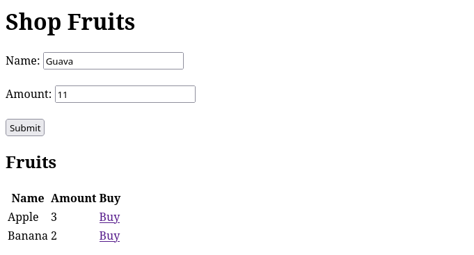

# PHP Fruits

A simple fruits app written in PHP

- [PHP Fruits](#php-fruits)
  - [Requirements](#requirements)
  - [Development](#development)
  - [Showcase](#showcase)


## Requirements

- PHP 7.1
- Sqlite3 extension

## Development

```bash
./run.sh
```

## Showcase

